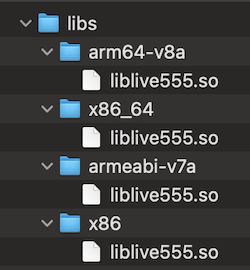

# live555-android
Toolchain to build `live555` libraries for `Android`

## Credits
First, credit to those who inspired/helped to put this together:

- **_Live555_** (http://live555.com) the RTSP tool/lib/apps being build. In this repo you will have version `2024.04.19`. If you want to check, look for files ending in `_version.hh`. They will contains a define ending in `VERSION_STRING`.

- **_live555-android_** (https://github.com/leepood/live555-android) The 9 years old repo that started me on good tracks. 🫡

- **_android-ifaddrs_** (https://github.com/NAbdulla1/cpp-httplib-with-ifaddrs-fixed-for-android) The repo which had the compile fix I needed.

## Description & Context
This repo contains everything you need to build `.so` libraries for `live555` on Android using the `NDK` tools.
It also includes the dependencies locally because I hate having to deal with each and everyone's specific pathing.

It produces the libraries inside a lib folder at the root of the repo:

## Environment
1. Android NDK (tested using 21)
2. Linux/macOS. Probably others, I didn't try.

## Usage
1. Clone the repo first
2. Execute `ndk-build` from within the jni folder. Make sure to use the right ndk - likely to be in a folder like `~/Android/Sdk/ndk/21.3.xxxxx/ndk-build`. 
Add `--trace` to it if you see compile errors.
3. After success build, you will get the `live555.so` in the `libs` folder, under their respective platform (see pic above)

## Pre-built libs
I've also included pre-built libs for the common platforms for those who want to be going straight there.

## License
Following the licenses of the dependencies, this is a GPL3 project.

## Contribution
Open a PR, I'll get the notif, review and merge as needed.